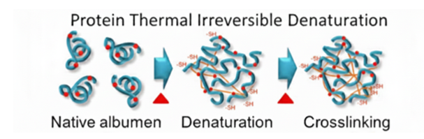
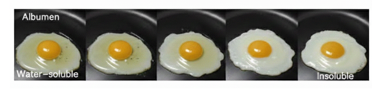

Proteins are complex macromolecules composed of amino acids linked by peptide bonds. Their specific three-dimensional structure is maintained by hydrogen bonds, ionic interactions, hydrophobic interactions, and disulfide bridges. This ordered structure (primary, secondary, and tertiary levels) is essential for protein functionality. 

When proteins are exposed to heat, these stabilizing interactions weaken and eventually break. This process is known as denaturation. During denaturation, the protein unfolds from its native conformation, as shown in figure below. Although the primary structure (peptide bonds) remains intact, the secondary and tertiary structures are disrupted. As heating continues, unfolded protein molecules interact with each other, forming aggregates. This aggregation leads to coagulation and visible solidification. 

 
 
Egg albumen, mainly composed of ovalbumin, is an ideal model system to demonstrate protein denaturation. At room temperature, egg white appears translucent and fluid because proteins are in their native folded state. Upon heating, denaturation begins (around 60–65°C), and progressive coagulation occurs. At higher temperatures, a firm, opaque gel is formed due to extensive protein aggregation.
The following figure represents how the egg albumen turns from  liquid to solid upon heating due to protein denaturation 

  
 
This temperature-dependent transformation clearly demonstrates how heat affects protein stability and structure, making the process of denaturation visually observable in egg albumen.

<!--Proteins are complex macromolecules made up of amino acid chains linked by peptide bonds. They have a unique three-dimensional structure maintained by hydrogen bonds, ionic bonds, and disulfide bridges. When proteins are subjected to heat, these interactions break down, leading to a phenomenon known as denaturation. Denatured proteins lose their native structure and often aggregate, resulting in precipitation or changes in physical state. Egg albumen, primarily composed of the protein ovalbumin, provides a visual and measurable system to study protein denaturation. At lower temperatures, proteins remain in their natural state, leading to a translucent and liquid consistency. As the temperature increases, protein denaturation begins, leading to coagulation and eventual formation of a solid, opaque mass at higher temperatures. This experiment highlights the temperature-dependent nature of protein stability and the onset of denaturation.
